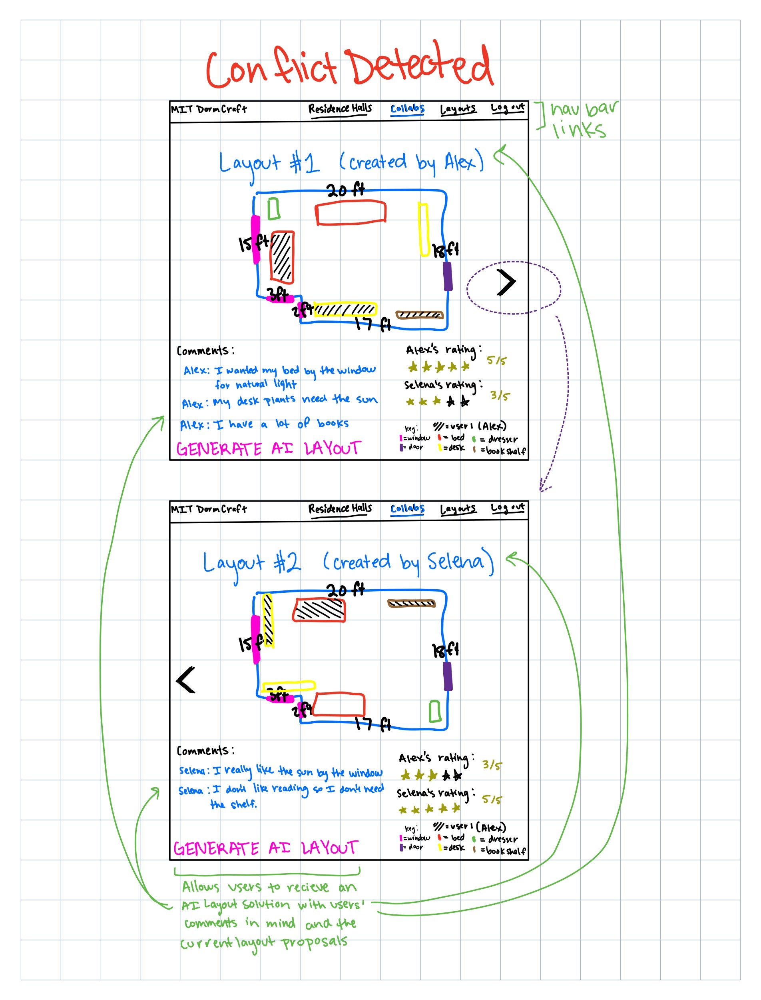

# MIT DormCraft 
Moving into MIT dorms is stressful, especially when roommates don’t know how the room looks or how to share space fairly. DormCraft solves this by giving students a collaborative, visual planning tool.

# 
Augment the Design of a Concept

**Original Concept Specification: Collaboration Board**

    concept: CollaborationBoard

    purpose: Allow roommates to jointly propose, edit, and comment on room layouts in real time. Serves as the shared workspace where layouts are iterated on.

    principle: The board provides a generic space for collaborative editing. In DormCraft, it is specifically instantiated with room layouts generated using the RoomModel and FurnitureLibrary.

    state:
        - a set of Boards with
            boardID             String
            users               Set
            layouts             Set
            comments            List<{user: User, text: String, timestamp: Float}>
        
    actions:
    - addLayout(board: Board, layout: Layout)
        effects: stores a new proposed layout in the board

    - comment(board: Board, user: User, text: String)
        effects: attaches a comment to the board

    - shareLink(board: Board): (url: String)
        effects: generates a shareable link for collaborators

 
 

**AI-Augmented Version: Collaboration Board with AI**

    concept: AIAugmentedCollaborationBoard

    purpose: 	Allow roommates to jointly propose, edit, and comment on room layouts in real time. Additionally, leverage AI to analyze proposals and suggestions to automatically generate compromise or optimized layouts.
    
    principle: The board is the shared workspace. The AI feature is a non-user participant that can synthesize existing user proposals and textual comments to produce a new, potentially superior layout, fostering agreement. The AI-generated layout is a new proposal and requires user review.
    
    state:
        - a set of Boards with
            boardID             String
            users               Set
            layouts             Set
            comments            List<{user: User, text: String, timestamp: Float}>
            roomModelID         String
        
    actions:
    - addLayout(board: Board, layout: Layout)
        effects: stores a new proposed layout in the board

    - comment(board: Board, user: User, text: String)
        effects: attaches a comment to the board

    - shareLink(board: Board): (url: String)
        effects: generates a shareable link for collaborators

    - suggestLayout(board: Board): (newLayout: Layout) 
        effects: Calls an LLM with the room model data, all proposed layouts, and all comments. The LLM generates a new, optimized layout based on the input. This new layout is then stored in the board and tagged as AI-generated.

 
 
 

# 
Design the User Interaction

**Sketch 1: Conflict Detected**
 
Context for LLM: The LLM receives Layout A (Alex's preference), Layout B (Selena's preference),  the comments thread for both ("I need the window for my desk for my plants and I like sun by my bed," "I want my desk by the sun because that's how I work best") and the Room Model ID for dimensions of that room.

  

**Sketch 2: AI Proposal**
 
Context for LLM: The LLM output is a new layout object (position and rotation for all furniture) and a justification summary ("This layout provides a compromise for both desks to to be by the window to address Selena's light need and Alex's space concern").

  

**User Journey:**
 
Selena and Alex have added two conflicting layouts, LSelena and LAlex , to their Collaboration Board. Selena comments, "I  need the window for my desk for my plants and I like sun by my bed," and Alex comments, "I want my desk by the sun because that's how I work best" Unable to agree, Selena clicks the "Generate AI Layout" button. DormCraft sends the two layouts, the room's fixed feature data (from RoomModel), and the latest comments to the LLM. The LLM processes this information and returns a new layout, AI Layout, which features both desks by the window and similar positioning for the beds. The new layout is automatically added to the board, tagged as "AI Suggestion," along with a summary of its rationale. Selena and Alex review the new AI Layout and agree that it cleverly satisfies both their primary needs, and instantly select it as the winning layout by giving it 5 stars each!

 
 
 

# 
Implement Concept

[Code Repo with Augemented Code](https://github.com/kayleorantes/dormcraft/tree/main)
 
 

[Driver to Execute Test Cases](dormcraft_tests.ts)
 
 

[Concept Specifications](dormcraft.spec)

 
 

# 
Explore Richer Test Cases and Prompts

All 3 test cases are implemented in [this file](dormcraft_tests.ts) and are further elaborated below.

**Test Case 1: AI-Assisted Conflict Resolution (Proving Synthesis)**
 
User Actions:
 
1. Roommates add conflicting layouts L1 and L2 (both place their desk in the prime window location). 
2. Comments explicitly state the priority conflict: "need the window for my plants and sun for studying" vs. "want my desk by the sun." 3. User calls suggestLayout().

 
Prompt Instruction: 
 
"The core conflict is that both users claim the single window spot. Generate a compromise layout where both desks are positioned along the Y=10.5 wall, allowing both users equal proximity to natural light. The beds must be against the Y=0.5 wall to maximize central flow."

 
 

Analysis:	
 
This test validated the AI's ability to handle two identical, opposing claims. We used the prompt to enforce a synthesis solution by locking both desks to the shared preference zone (Y=10.5 wall). What Worked: The LLM successfully returned a layout (L3) that satisfied the shared priority by enforcing the compromise placement for both desks, demonstrating the AI's power to translate abstract agreement (shared sun access) into a concrete, non-conflicting layout. What Went Wrong: Initial prompts often failed due to the LLM placing furniture directly into the Y=14.5 no-go zone, requiring the explicit coordinate Y=10.5 in the final prompt. Issues Remain: The LLM still requires the code's post-generation validators to ensure the coordinates are perfectly safe and non-overlapping.

**Test Case 2: Validator Failure - Door Block (Proving Necessity of V1)**
 
User Actions:
 
1. User attempts to load a custom layout (L_BAD_V1) where a desk is intentionally positioned at (X=1.5,Y=1.5). 
2. No LLM action is explicitly called; the validator runs automatically when addLayout is executed.

 

Analysis:
 
This experiment was designed to prove the resilience of the system against a geometric impossibility. The layout deliberately placed the desk within the door_swing no-go zone (X<3.0,Y<3.0). What Worked: The system correctly intercepted the layout with the error: Failed to add layout: [Validator 1] Furniture 'MIT Desk' placed in fixed feature zone 'door_swing'. This proves the checkFixedFeatureOverlap (Validator 1) is active and prevents physically unusable outputs, regardless of whether a human or AI proposes them. What Went Wrong: The failure was the goal of the test. Issues Remain: None, the test successfully confirms that code-level geometric constraints take precedence over all user or AI input.

**Test Case 3: Validator Failure - Missing Item (Proving Necessity of V3)**
 
User Actions:
 
1. User attempts to load a custom layout (L_HALL) that contains only one bed_twin_xl piece, instead of the required two. 
2. No LLM action is explicitly called; the validator runs automatically when addLayout is executed.

 

Analysis
 
This test was designed to prove the system's resilience against resource violation—a common failure mode where an LLM may omit a required item to achieve a better aesthetic goal. What Worked: The system correctly failed to add the layout with the error: Failed to add layout: [Validator 3] Layout must contain exactly 2 of item bed_twin_xl, but found 1. This confirms the checkFurnitureInventory (Validator 3) is active, ensuring all solutions (AI-generated or user-generated) adhere to the MIT Housing inventory list. What Went Wrong: The failure was the goal of the test. Issues Remain: None, the test successfully confirms that resource and inventory constraints are enforced before any layout is finalized.

 
 
 

# 
Add Validators to Code

Even with the well-specified prompts, LLMs are prone to generating coordinates that are logically or physically impossible. Our three implemented validators serve as the essential security and integrity layer that protects the DormCraft application from flawed AI output. 1) Fixed Feature Obstruction: The AI is poor at spatial subtraction and may place furniture within the coordinates reserved for non-movable objects like the door swing, violating a fundamental constraint. 2) Geometric Overlap: The AI fails the bounding box check by placing two items in the same space or pushing an item outside the room's boundary, resulting in a physically impossible layout. 3) Inventory Violation: The AI ignores the resource constraint and either hallucinates extra furniture (e.g., a third dresser) or forgets to include a required item (e.g., only one desk), making the layout invalid per the Housing Office's inventory.

**Issue: Obstruction of Fixed Features**
 
 
Description: The AI places a piece of furniture in a fixed, non-negotiable area, such as blocking the door's swing arc, a window, or a vent. This makes the layout unusable.
 
 
Validator: check_fixed_feature_overlap(layout, room_features)
 
- Checks the coordinates of all placed furniture items against a list of "no-go zones" defined by the RoomModel (e.g., a door's swing arc, defined as a polygon or set of coordinates). If a piece of furniture overlaps with a no-go zone, it throws an error.

 
 

**Issue: Furniture Overlap or Wall Proximity**
 
 
Description: The AI generates a layout where two pieces of furniture occupy the same space, or a piece of furniture is positioned partially outside the room's dimensions (e.g., x > room_width). This makes the layout physically impossible.
 
 
Validator: check_physical_overlap_and_bounds(layout, room_dimensions)
 
- Overlap Check: Iterates through all pairs of furniture items and checks if their bounding boxes intersect.
- Boundary Check: Checks if any furniture item's coordinates and dimensions place it outside the room_dimensions (e.g., x position +x dimension >room_width). Throws an error if either condition is met.

 
 

**Issue: Hallucination of Unrequested Furniture**
 
 
Description: The AI adds a piece of furniture that was not available in the FurnitureLibrary or was not requested for the room (e.g., adding a third bed in a double room). This makes the layout inaccurate to the available resources.
 
 
Validator: check_furniture_inventory(layout, required_furniture_list)
 
- Compares the list of furniture items in the AI's generated layout against the required_furniture_list (which comes from the RoomModel and FurnitureLibrary). If the layout contains an item not in the available list, or if it changes the count of a required item (e.g., only one bed instead of two), it throws an error.
