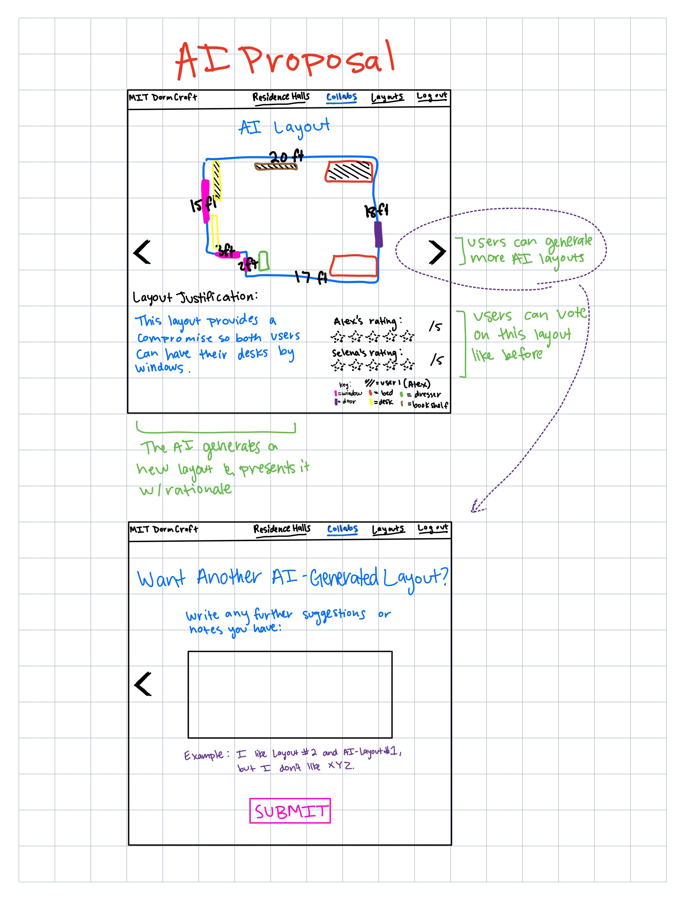

# 
Augment the Design of a Concept

**Original Concept Specification: Collaboration Board**

    concept: CollaborationBoard

    purpose: Allow roommates to jointly propose, edit, and comment on room layouts in real time. Serves as the shared workspace where layouts are iterated on.

    principle: The board provides a generic space for collaborative editing. In DormCraft, it is specifically instantiated with room layouts generated using the RoomModel and FurnitureLibrary.

    state:
        - a set of Boards with
            boardID             String
            users               Set
            layouts             Set
            comments            List<{user: User, text: String, timestamp: Float}>
        
    actions:
    - addLayout(board: Board, layout: Layout)
        effects: stores a new proposed layout in the board

    - comment(board: Board, user: User, text: String)
        effects: attaches a comment to the board

    - shareLink(board: Board): (url: String)
        effects: generates a shareable link for collaborators

**AI-Augmented Version: Collaboration Board with AI**

    concept: AIAugmentedCollaborationBoard

    purpose: 	Allow roommates to jointly propose, edit, and comment on room layouts in real time. Additionally, leverage AI to analyze proposals and suggestions to automatically generate compromise or optimized layouts.
    
    principle: The board is the shared workspace. The AI feature is a non-user participant that can synthesize existing user proposals and textual comments to produce a new, potentially superior layout, fostering agreement. The AI-generated layout is a new proposal and requires user review.
    
    state:
        - a set of Boards with
            boardID             String
            users               Set
            layouts             Set
            comments            List<{user: User, text: String, timestamp: Float}>
            roomModelID         String
        
    actions:
    - addLayout(board: Board, layout: Layout)
        effects: stores a new proposed layout in the board

    - comment(board: Board, user: User, text: String)
        effects: attaches a comment to the board

    - shareLink(board: Board): (url: String)
        effects: generates a shareable link for collaborators

    - suggestLayout(board: Board): (newLayout: Layout) 
        effects: Calls an LLM with the room model data, all proposed layouts, and all comments. The LLM generates a new, optimized layout based on the input. This new layout is then stored in the board and tagged as AI-generated.

# 
Design the User Interaction

**Sketch 1: Conflict Detected**
 
Context for LLM: The LLM receives Layout A (Alex's preference), Layout B (Selena's preference),  the comments thread for both ("I need the window for my desk for my plants and I like sun by my bed," "I want my desk by the sun because that's how I work best,") and the Room Model ID for dimensions of that room.

  

**Sketch 2: AI Proposal**
 
Context for LLM: The LLM output is a new layout object (position and rotation for all furniture) and a justification summary ("This layout provides a compromise for both desks to to be by the window to address Selena's light need and Alex's space concern").

  

**User Journey:**
 
FIX FIX FIX

 
 
 
Selena and Alex have added two conflicting layouts, LSelena and LAlex , to their Collaboration Board. Selena comments, "I must have the desk near the window," and Alex comments, "I need the floor space the closet alcove offers." Unable to agree, Selena clicks the "Ask AI for Compromise" button. DormCraft sends the two layouts, the room's fixed feature data (from RoomModel), and the latest comments to the LLM. The LLM processes this information and returns a new layout, LAI , which features both beds lofted to open up two desk spaces near the window, with the dressers stored under the lofts near the alcove. The new layout, LAI , is automatically added to the board, tagged as "AI Suggestion," along with a summary of its rationale. Selena and Alex review LAI , agree that it cleverly satisfies both their primary needs, and instantly select it as the winning layout, avoiding the need for a protracted vote.

# 
Implement Concept

ATTACH LINK HERE TO MAIN REPO

# 
Explore Richer Test Cases and Prompts

TEST CASES IN REPO

PARA 1 HERE

PARA 2 HERE

PARA 3 HERE

# 
Add Validators to Code

Issue: Obstruction of Fixed Features
Description: The AI places a piece of furniture in a fixed, non-negotiable area, such as blocking the door's swing arc, a window, or a vent. This makes the layout unusable.
Validator: check_fixed_feature_overlap(layout, room_features)
-Checks the coordinates of all placed furniture items against a list of "no-go zones" defined by the RoomModel (e.g., a door's swing arc, defined as a polygon or set of coordinates). If a piece of furniture overlaps with a no-go zone, it throws an error.

Issue: Furniture Overlap or Wall Proximity
Description: The AI generates a layout where two pieces of furniture occupy the same space, or a piece of furniture is positioned partially outside the room's dimensions (e.g., x > room_width). This makes the layout physically impossible.
Validator: check_physical_overlap_and_bounds(layout, room_dimensions)
-Overlap Check: Iterates through all pairs of furniture items and checks if their bounding boxes intersect.
-Boundary Check: Checks if any furniture item's coordinates and dimensions place it outside the room_dimensions (e.g., x position +x dimension >room_width). Throws an error if either condition is met.

Issue: Hallucination of Unrequested Furniture
Description: The AI adds a piece of furniture that was not available in the FurnitureLibrary or was not requested for the room (e.g., adding a third bed in a double room). This makes the layout inaccurate to the available resources.
Validator: check_furniture_inventory(layout, required_furniture_list)
-Compares the list of furniture items in the AI's generated layout against the required_furniture_list (which comes from the RoomModel and FurnitureLibrary). If the layout contains an item not in the available list, or if it changes the count of a required item (e.g., only one bed instead of two), it throws an error.
